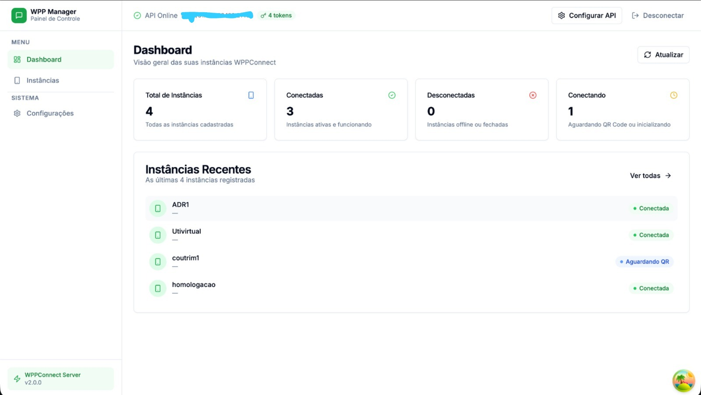
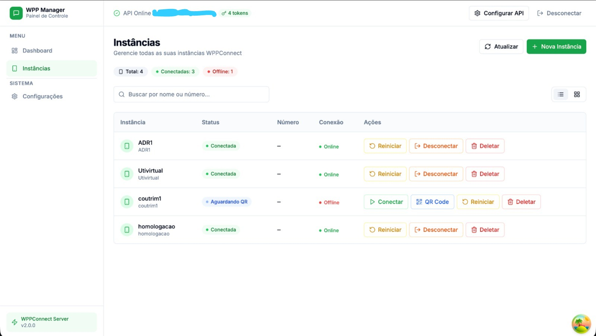

# WPP Manager

Painel open source para gerenciamento de instâncias do **WPPConnect Server**.

O **WPP Manager** fornece uma interface moderna para visualizar, controlar e administrar múltiplas instâncias do WhatsApp conectadas ao servidor.

O projeto foi criado para facilitar o gerenciamento de automações WhatsApp em ambientes com múltiplas sessões.

---

## Preview

### Dashboard

### Instâncias

---

## Funcionalidades

- 📊 Dashboard com visão geral das instâncias
- 📱 Visualização de instâncias conectadas
- 🟢 Status em tempo real das conexões
- 🔄 Reinício de instâncias
- 🔌 Desconexão de sessões
- ➕ Criação de novas instâncias
- 📷 Conexão via QR Code
- 🔐 Autenticação via Token API
- ⚡ Atualização automática do status das instâncias

---

## Status das Instâncias

O painel identifica automaticamente o estado de cada instância:

| Status          | Descrição                     |
| --------------- | ----------------------------- |
| 🟢 Conectada    | WhatsApp conectado            |
| 🟡 Conectando   | Aguardando leitura de QR Code |
| 🔴 Desconectada | Instância offline             |

---

## Tecnologias Utilizadas

Este projeto foi construído com:

- **Next.js**
- **TypeScript**
- **TailwindCSS**
- **Shadcn UI**
- **Axios**
- **React Query**
- **Zustand**

---

## Integração

O sistema consome a API do:

**WPPConnect Server**

Documentação oficial:

https://github.com/wppconnect-team/wppconnect-server

---

## Instalação

Clone o projeto:
